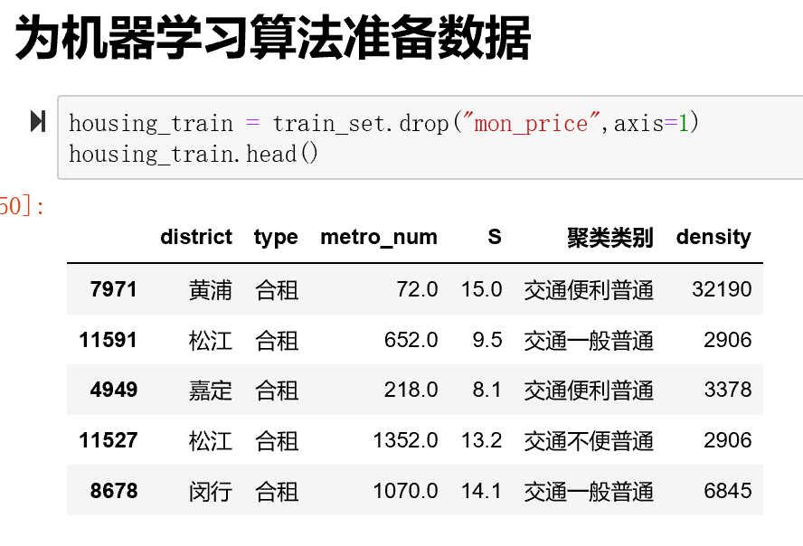
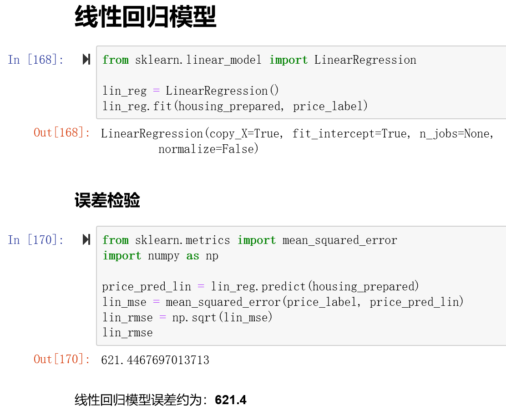
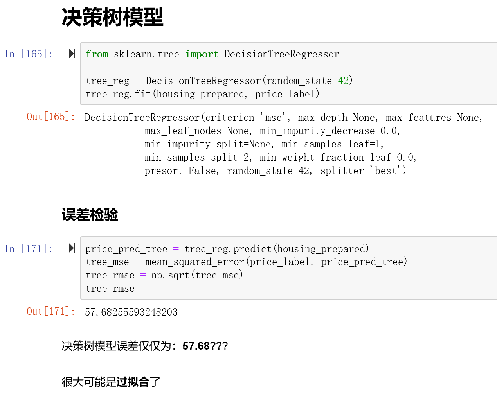
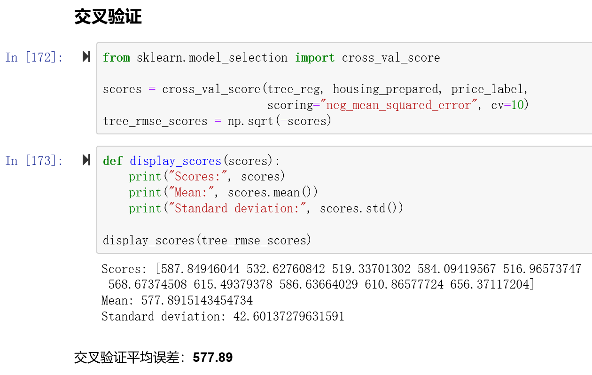
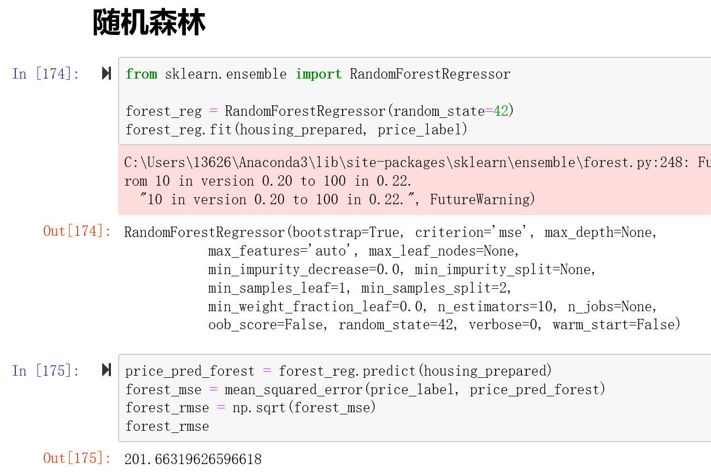
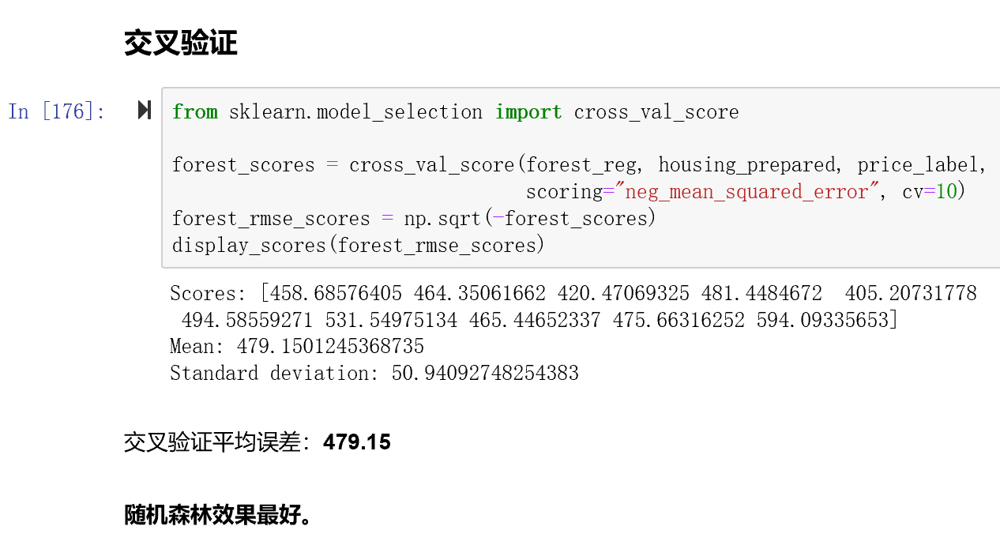

# 自如聚类分析与可视化
爬取自如所有上海房源，进行k-means聚类分析，将房源划分为不同等级。将对数据进行进一步分析。

---

## 数据

---

## 聚类后的dataframe结果

---

## 可视化图表

- 堆叠柱状图

- 饼图

- 3D柱状图

- 结果

---

# 机器学习部分

## 数据

- 机器学习的数据：用**'metro_num', 'S', 'density', '聚类类别'**预测**每月租金**

---

## 线性回归模型

- 训练集上误差约为：**621.4**

---

## 决策树模型

- 训练集上误差约为：**57.68**，推测为**过拟合**了。

- 使用交叉检验得出误差约为：**577.89**

---

## 随机森林模型

- 训练集上误差约为：**201.6**，推测应该也为**过拟合**了。

- 使用交叉检验得出误差约为：**479.15**

### 最优微调模型
- **max_features: 2, n_estimators: 30**时，效果最好，误差为**451.98**

---

